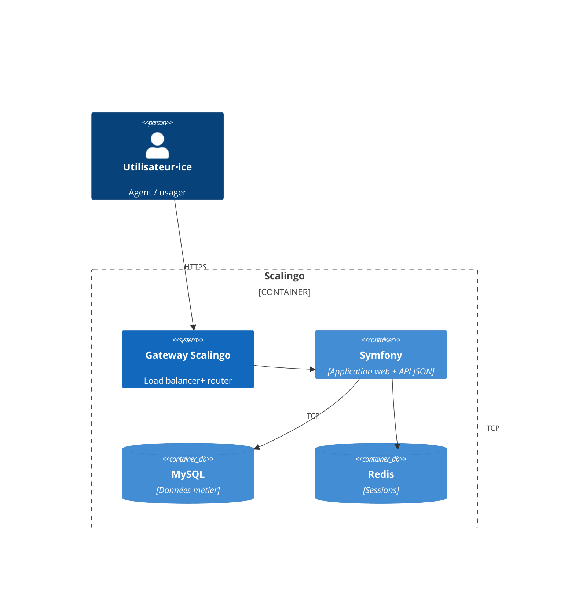
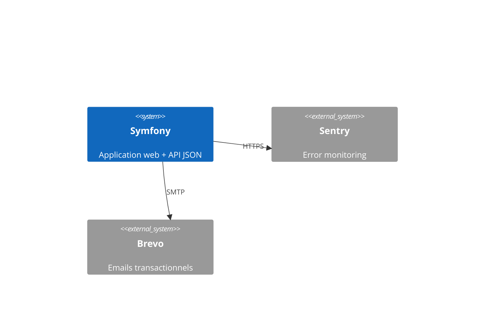
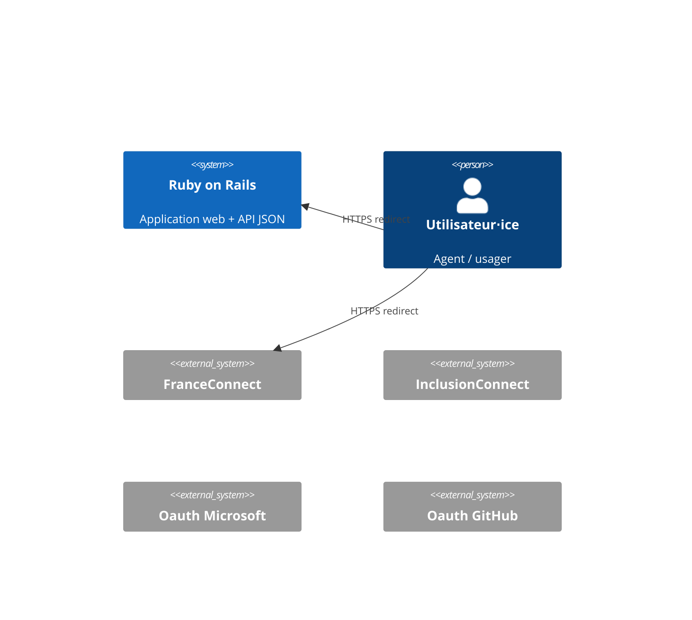

# Dossier technique

> Ce dossier a pour but de présenter l’architecture technique du SI. Il n’est par conséquent ni un dossier d’installation, ni un dossier d’exploitation ou un dossier de spécifications fonctionnelles.

**Nom du projet :** Aides-territoires

**Dépôt de code :** https://github.com/MTES-MCT/aides-territoires-symfony

**Hébergeur :** Scalingo, Paris (région Scalingo "osc-fr1")

**Décision d’homologation :** !!En attente!!

**France Relance :** ❌

**Inclusion numérique :** ❌

## Suivi du document

> Le suivi de ce document est assuré par le versionnage Git.

## Fiche de contrôle

> Cette fiche a pour vocation de lister l’ensemble des acteurs du projet ainsi que leur rôle dans la rédaction de ce dossier.

| Organisme                  | Nom                   | Rôle                   | Activité  |
|----------------------------|-----------------------|------------------------|-----------|
| Aides-territoires          | Rémi BARRET           | Lead tech              | Relecture + Rédaction |

## Description du projet

Aides-territoires facilite la recherche d'aides des collectivités territoriales et de leurs partenaires locaux.

Il est open source, bien que toutes les instances soient gérées par l'équipe.

Plus d'infos sur la fiche beta : https://beta.gouv.fr/startups/aides-territoires.html

## Architecture

### Stack technique

Le projet utilise Symfony avec une base MySQL, les sessions sont stockées dans Redis. L'infrastructure est entièrement gérée par Scalingo en PaaS.

Le javascript du projet est principalement du jQuery, un peu de Vanilla JS). Coté CSS / composants, c'est le Design System de l'état (DSFR) pour les interfaces usager et Bootstrap pour l'administration.

### Matrice des flux

#### Applications métier sur Scalingo

| Source           | Destination       | Protocole | Port | Localisation      | Interne/URL Externe |
|------------------|-------------------|-----------|------|-------------------|---------------------|
| Navigateur       | App Symfony         | HTTPS     | 443  | osc-fr1 | Externe             |
| Clients API JSON | App Symfony         | HTTPS     | 443  | osc-fr1 | Externe             |          |
| App Symfony        | MySQL Scalingo | TCP       | 5432 | osc-fr1 | Interne             |
| App Symfony        | Redis Scalingo    | TCP       | 6379 | osc-fr1 | Interne             |

#### Tooling (error monitoring, APM)

| Source     | Destination | Protocole | Port | Localisation              | Interne/URL Externe                             |
|------------|-------------|-----------|------|---------------------------|-------------------------------------------------|
| App Symfony  | Sentry      | HTTPS     | 443  | Tours, France             | https://terrab.sentry.io                           |

#### Services externes

| Source                            | Destination                | Protocole     | Port | Localisation        | Interne/URL Externe                 |
|-----------------------------------|----------------------------|---------------|------|---------------------|-------------------------------------|
| App Symfony                         | Brevo                      | SMTP          | 587  | Paris, France       | smtp-relay.sendinblue.com           |

#### Fournisseurs d'identité

| Source     | Destination      | Protocole     | Port | Localisation        | Interne/URL Externe            |
|------------|------------------|---------------|------|---------------------|--------------------------------|
| Navigateur | ProConnect    | HTTPS (OAuth) | 443  | Paris, France       | https://www.proconnect.gouv.fr/      |
| Navigateur | App Symfony | HTTPS | 443  | France              | https://aides-territoires.beta.gouv.fr/comptes/connexion/ |                 |

### Inventaire des dépendances

| Nom de l’applicatif | Service          | Version   | Commentaires                                                    |
|---------------------|------------------|-----------|-----------------------------------------------------------------|
| Serveur web         | Symfony @ Scalingo | Symfony 6.4   | Voir ci-dessous pour le détail des librairies                   |
| BDD métier          | MySQL       | `8.0.35` | Stockage des données métier, voir [db/schema.rb](/db/schema.rb) |
| Session       | Redis            | `7.2.5`   | Stockage des sessions                                |

La liste des librairies Php est disponible dans :
- [composer.json](/composer.json) pour la liste des dépendances directes et la description de la fonctionnalité de chacune des gems
- [composer.lock](/composer.lock) pour la liste complète des librairies utilisées directement et indirectement (dépendances
  indirectes), et leurs versions précises

La liste des librairies JS utilisée est disponible dans :

- [package.json](/package.json) pour la liste des dépendances directes
- [package.json](/yarn.lock) pour la liste complète des librairies JS utilisées directement et indirectement (
  dépendances indirectes), et leurs versions précises

### Schéma de l’architecture

Notre application est accessible sous  :
- https://aides-territoires.beta.gouv.fr/

`https://aides-territoires.beta.gouv.fr/` est notre instance de production actuelle. 

Chaque schémas ci-dessous représente une seule instance (une seule app Scalingo), qu'elle soit de prod ou de démo.

#### Architecture interne à Scalingo

#### Échanges entre l'app et les services externes

#### Échanges entre l'app, les fournisseurs d'identités, et les utilisateur⋅ices

### Gestion DNS

C'est **Scalingo** qui fournit nos noms de domaine et la gestion DNS.

Nous y gérons les domaines suivants :
- `aides-territoires.beta.gouv.fr` : domaine de production historique

### Schéma des données

[at_database_schema.svg](/at_database_schema.svg)

## Exigences générales

### Accès aux serveurs et sécurité des échanges

Les serveurs (applicatif et base de données) sont gérés par Scalingo. Scalingo ne fournit pas de système de rôle : soit
on a accès à une app, soit on ne l'a pas.

Le fait d'avoir accès à une app Scalingo donne les droits suivants :

- augmenter ou réduire le nombre d'instances applicatives de l'app / régler les paramètres d'autoscaling
- administrer la base MySQL (changer la taille de l'instance, mettre à jour MySQL, télécharger des backups, etc)
- administrer la base Redis (même fonctionnalités que pour MySQL ci-dessus)
- visualiser les déploiements passés ou en cours
- configurer le déploiement automatique d'une branche GitHub
- visualiser l'activité de l'app (scaling, déploiements, commandes lancées en one-off)
- visualiser les logs (app + jobs + routeur Scalingo) et en télécharger des archives
- visualiser des metrics (requêtes par minute, temps de réponse, CPU, RAM)
- lire et modifier les variables d'environnements :
  - credentials SMTP du compte
  - credentials de MySQL
  - credentials ProConnect
  - credentials Brevo (ex Sendinblue)
- octroyer aux équipes support Scalingo le droit d'accéder à l'environnement d'exécution de l'application et aux
  métadonnées et aux données de surveillance des bases de données
- ajouter ou supprimer des collaborateurs sur l'app
- ajouter au supprimer les domaines autorisés à pointer vers l'app
- gérer les alertes

Les accès Scalingo sont octroyés uniquement à l'équipe technique ("devs") car iels en ont besoin de tout ou une partie
des fonctionnalités listées afin de :

- surveiller la santé de l'app de production
- lancer une console distante en production afin d'investiguer des bugs
- ajouter ou mettre à jour des variables d'environnement
- vérifier le bon déploiement des nouvelles versions du code

**Scalingo propose du 2FA par TOTP, mais aucun mécanisme ne force les collaborateurs à l'activer. Nous avons donc dans
notre checklist d'onboarding un point précisant qu'il faut impérativement activer le 2FA.** En cas de perte des codes
TOTP, Scalingo propose une procédure qui inclut la vérification de l'identité de l'utilisateur concerné par la
transmission d'un document d'identité.

#### Détection de fuite de secrets

Nous avons activé la fonctionnalité "Secret scanning" de GitHub sur notre dépôt. Ce système envoie des alertes et bloque le push si des secrets sont détectés dans un commit.

GitGuardian, qui fait de la détection automatisée de fuites de secrets est aussi activé parmis les Github actions de la CI.

### Authentification, contrôle d’accès, habilitations et profils

L'application a 2 types d'utilisateurs :
- usager⋅e
- admin
L'utilisateur peut ajouter / consulter des aides, des projets.

Les comptes utilisateurs ont une contrainte d'unicité sur les emails.

Les sessions sont déconnectées automatiquement.

#### Les usager⋅es

Les usager⋅es contribuent ou consultent l'annuaire d'aides. Iels peuvent changer son e-mail, mot de passe et infos personnelles.

La connexion à un profil usager est faite par email + mot de passe. Les mots de passes sont stockés salés et chiffrés. Une connexion via ProConnect est aussi proposée : un compte est alors
créé ou relié si l'e-mail existe déjà dans notre base usagers.

Un mot de passe à les restrictions suivantes : 
 - doit contenir au minimum 9 caractères.
 - ne peut pas être un mot de passe couramment utilisé.
 - ne peut pas être entièrement numérique.

#### Les admins

Les agents ont accès à diverses fonctionnalités touchants à :
- les aides
- les projets
- les portails
- le blog
- les périmètres

La connexion à un profil agent est faite par email + mot de passe. Les mots de passes sont stockés salés et chiffrés.
Suivi d'une identification à double facteur avec un jeton TOTP.

### Traçabilité des erreurs et des actions utilisateurs

#### Logs textuels

Les logs textuels sont écrits dans le système de log de Scalingo. Cela comprend :
- Les logs des commandes de la production (e.g. lancer la console)
- les changements de variables d'environnements

Les logs applicatifs (générés par Symfony et Sentry) contiennent, pour chaque requêtes HTTP :

- timestamp
- path HTTP
- méthode HTTP
- format (HTML, JSON)
- controller + action
- durée

Les logs produits par le routeur de Scalingo contiennent, pour chaque requêtes HTTP :

- timestamp
- path HTTP
- méthode HTTP
- IP d'origine
- referer
- user agent

La consultation des logs textuels ne se fait que lors d'investigations de bugs. Leur usage est donc uniquement ponctuel
et leur consultation est manuelle. Nous n'avons pas de système d'analyse de logs.

#### Monitoring d'erreur

Nous utilisons Sentry afin d'être informé⋅es sur les nouvelles erreurs, et le volume des erreurs existantes.
Nous sommes alerté⋅es en cas de nouvelles erreurs ou volume inhabituel, en direct sur notre outil de
communication principal Mattermost. Nous utilisons une instance Sentry privée.

### Politique de mise à jour des applicatifs

Voici les cas dans lesquels nous mettons à jour une librairie spécifique :

- une version plus récente corrige une faille de sécurité (nous utilisons Dependabot pour être prévenu⋅es)
- une version plus récente permet de répondre à un besoin technique ou fonctionnel
- une montée de version est requises par une librairie correspondant aux critères ci-dessus (autrement dit, nous devons
  mettre à jour de manière indirecte)

Afin d'être prévenus lors de la publication d'une CVE, nous utilisons Dependabot sur notre dépôt GitHub.
Une alerte e-mail est envoyée aux devs qui watchent le dépôt (et nous faisons en sorte de le watch à travers
notre procédure d'onboarding).

### Détection des vulnérabilités

Nous avons également activé CodeQL sur notre dépot GitHub. Cet outil permet de détecter les vulnérabilités via une analyse statique du code.

### Intégrité

Des backups de nos bases de données MySQL sont faîtes automatiquement par Scalingo. Ces backups sont
créés quotidiennement et gardés 1 an.

Nous les testons régulièrement en les téléchargeant et en les chargeant dans notre environnement local.

Scalingo nous offre également la fonctionnalité de Point-in-time Recovery. Nous profitons également d'un système
de cluster avec 2 nodes, qui permet un failover automatique en cas de plantage d'une instance Postgres.

### Confidentialité

Parmi les données que nous manipulons, les plus critiques sont :
- les coordonnées des usager⋅es
